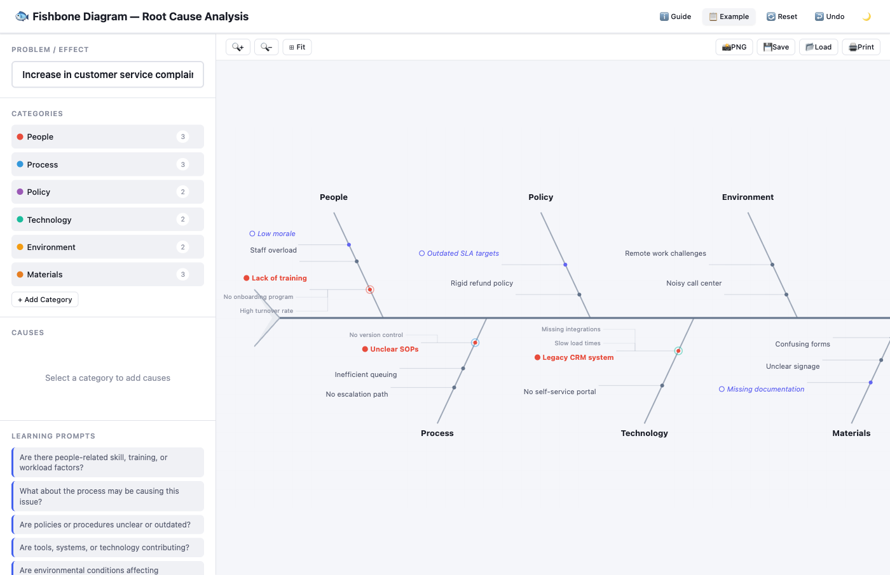

<div align="center">

# Fishbone Diagram — Root Cause Analysis Tool

[](https://developer.mozilla.org/en-US/docs/Web/HTML)
[](https://developer.mozilla.org/en-US/docs/Web/CSS)
[](https://developer.mozilla.org/en-US/docs/Web/JavaScript)
[](LICENSE)
[](https://alfredang.github.io/fishbone/)

**An interactive learning tool for practicing Root Cause Analysis using Fishbone (Ishikawa) Diagrams**

[Live Demo](https://alfredang.github.io/fishbone/) · [Report Bug](https://github.com/alfredang/fishbone/issues) · [Request Feature](https://github.com/alfredang/fishbone/issues)

</div>

## Screenshot



## About

A single-page interactive web app designed for **adult learners studying Six Sigma, Lean, and quality improvement** to practice building Fishbone Diagrams (Ishikawa / Cause-and-Effect Diagrams). Built as a classroom-friendly visual workshop tool.

### Key Features

| Feature | Description |
|---------|-------------|
| **Interactive SVG Diagram** | Visual fishbone with spine, category bones, cause branches, sub-causes, fish head & tail |
| **Problem Statement** | Enter the effect — it renders at the fish head with multi-line wrapping |
| **6 Default Categories** | People, Process, Policy, Technology, Environment, Materials — add, rename, delete |
| **Cause Management** | Add, edit inline, delete causes and sub-causes per category |
| **Priority Badges** | Mark causes as Possible, Likely Root Cause, or Needs Evidence |
| **Evidence & Notes** | Collapsible notes per cause for observations and data points |
| **Learning Prompts** | Coaching questions to guide brainstorming |
| **Export Options** | PNG image, JSON save/load, print-friendly layout |
| **Auto-Save** | localStorage persistence — never lose your work |
| **Sample Scenario** | One-click example with pre-populated causes, priorities, and notes |
| **Dark / Light Mode** | Theme toggle with persistence |
| **Undo Support** | Ctrl/Cmd+Z with 30-level undo stack |
| **Zoom Controls** | Zoom in/out + Ctrl+scroll on diagram |
| **Accessible** | Keyboard navigation, ARIA labels, non-color-only priority indicators |
| **Responsive** | Desktop, tablet, and mobile-friendly layout |

## Tech Stack

| Layer | Technology |
|-------|-----------|
| Markup | HTML5 |
| Styling | CSS3 (custom properties, flexbox, grid) |
| Logic | Vanilla JavaScript (ES6+) |
| Diagram | SVG (inline, dynamically generated) |
| Storage | localStorage (browser-native) |
| Export | Canvas API (SVG → PNG conversion) |
| Deploy | GitHub Pages (static HTML) |

## Architecture

```
┌─────────────────────────────────────────────────┐
│                   Browser                        │
│                                                  │
│  ┌──────────────┐   ┌────────────────────────┐  │
│  │   Sidebar     │   │   Diagram Area (SVG)   │  │
│  │              │   │                        │  │
│  │ • Problem    │   │  ←── Fish Tail         │  │
│  │ • Categories │──▶│  ════ Spine ════▶ Head │  │
│  │ • Causes     │   │  ╱╲  Category Bones    │  │
│  │ • Prompts    │   │  ── Cause Branches     │  │
│  └──────────────┘   └────────────────────────┘  │
│         │                                        │
│         ▼                                        │
│  ┌──────────────┐   ┌────────────────────────┐  │
│  │ localStorage  │   │  Export (PNG / JSON)    │  │
│  │ (auto-save)   │   │  Print (CSS @media)    │  │
│  └──────────────┘   └────────────────────────┘  │
└─────────────────────────────────────────────────┘
```

## Project Structure

```
fishbone/
├── index.html        # Complete app (HTML + CSS + JS)
├── screenshot.png    # App screenshot for README
├── .gitignore
└── README.md
```

## Getting Started

### Prerequisites

- A modern web browser (Chrome, Firefox, Safari, Edge)
- No build tools, frameworks, or dependencies required

### Run Locally

```bash
# Clone the repository
git clone https://github.com/alfredang/fishbone.git
cd fishbone

# Open in browser
open index.html
# or
python3 -m http.server 8000
# then visit http://localhost:8000
```

### How to Use

1. **Enter a problem statement** — describe the effect you're investigating
2. **Review categories** — use the defaults or customize them
3. **Select a category** — click to start adding causes
4. **Brainstorm causes** — add causes and sub-causes for each category
5. **Add evidence** — attach notes and observations to each cause
6. **Mark priorities** — tag causes as Possible, Likely, or Needs Evidence
7. **Export** — save as PNG, JSON, or print

## Deployment

### GitHub Pages

The app deploys automatically via GitHub Actions on push to `main`. Visit:

```
https://alfredang.github.io/fishbone/
```

### Manual Deploy

Since this is a single HTML file, you can host it anywhere:
- Drag `index.html` into any static hosting provider
- Upload to S3, Netlify, or any CDN
- Serve from any HTTP server

## Contributing

1. Fork the repository
2. Create your feature branch (`git checkout -b feature/amazing-feature`)
3. Commit your changes (`git commit -m 'Add amazing feature'`)
4. Push to the branch (`git push origin feature/amazing-feature`)
5. Open a Pull Request

## Acknowledgements

- **Kaoru Ishikawa** — inventor of the Fishbone (Ishikawa) Diagram
- Built with vanilla HTML, CSS, and JavaScript — no dependencies
- Designed for Six Sigma and quality improvement education

---

<div align="center">

If this tool helps your training sessions, give it a ⭐

</div>
